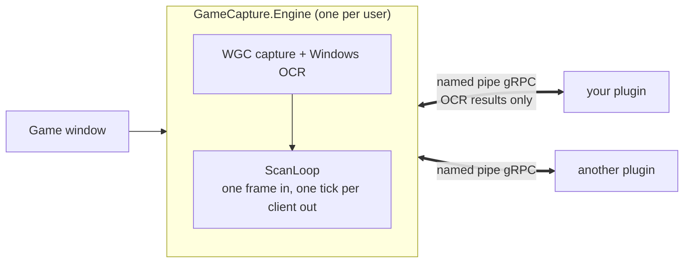

# GameCapture

[](https://github.com/PetitCastor/gamecapture-engine/actions/workflows/ci.yml)
[](https://github.com/PetitCastor/gamecapture-engine/releases)

**Read a game's own UI and turn it into data — without reading the game.** GameCapture
captures the screen, runs OCR on the regions a plugin asks for, and hands each plugin one frame's
worth of readings at a time. Nothing touches game memory, game files, or the network: what a player
can see, a plugin can record.

A **capture engine** owns the screen, the OCR, and the hotkey. Each **plugin** is a separate process
that owns nothing but its own parsing and state. They talk over named-pipe gRPC, and only OCR
results and small pixel buffers ever cross — so a plugin cannot take down capture, cannot see
another plugin, and cannot be brought down by either.



## Scope of this repository

This repo is the **engine side** and nothing else: the capture engine, the wire contract, the plugin
SDK, and the `dotnet new gamecapture-plugin` template — everything a plugin author consumes, and
nothing game-specific.

**Plugins live in a separate repository, [`gamecapture-plugins`](https://github.com/PetitCastor/gamecapture-plugins)**
(`MissionPlugin`, `RefineryPlugin` — game-specific trackers built as pure SDK consumers). You do not
need this repo to write a plugin: install the template from nuget.org and reference the packages
below. Clone this one only to work on the engine, the protocol, or the SDK itself.

## Published artifacts

| Artifact | What it is |
| --- | --- |
| [`GameCapture.Sdk`](https://www.nuget.org/packages/GameCapture.Sdk) | Plugin SDK: engine client, `IGameCapturePlugin`, `GameCapturePluginHost`. What a plugin references. |
| [`GameCapture.Contracts`](https://www.nuget.org/packages/GameCapture.Contracts) | Generated wire-contract code plus the pure types both sides share. |
| [`GameCapture.Sdk.Testing`](https://www.nuget.org/packages/GameCapture.Sdk.Testing) | Testing companion: `TickDataBuilder`, `FakePluginServices`, `ReplayHarness`, `EngineLocator`. |
| [`GameCapture.Plugin.Template`](https://www.nuget.org/packages/GameCapture.Plugin.Template) | `dotnet new gamecapture-plugin` — a working plugin plus its test project. |
| [Releases](https://github.com/PetitCastor/gamecapture-engine/releases) | `GameCapture.Engine-vX.Y.Z-win-x64.zip`, a self-contained engine exe. |

All four packages share one version train (MinVer, off the `v*` tag): one release is one compatible
set. See [`docs/COMPATIBILITY.md`](docs/COMPATIBILITY.md).

## Writing a plugin

A plugin is a plain `net10.0` console process: it declares the screen regions it wants and what to do
with each tick of readings. It never captures, never runs OCR, and never speaks gRPC —
`GameCapturePluginHost` owns connecting, subscribing, reconnecting, cancellation, and the end-of-run
summary. You do not clone or build this repo to write one; you need the .NET 10 SDK and an engine
binary to talk to.

**1. Scaffold the project.**

```powershell
dotnet new install GameCapture.Plugin.Template
dotnet new gamecapture-plugin -n MyPlugin
```

That writes the whole thing: `MyPlugin.csproj` (a `PackageReference` on `GameCapture.Sdk` and
`GameCapture.Contracts`), `Program.cs` (one line — hand the plugin to the host), `Rois.cs`,
`MyPlugin.cs` with one placeholder region, `config.json`, a test project wired against
`GameCapture.Sdk.Testing`, and a CI workflow stub. `--SdkVersion` pins the package version
(default `1.*`).

**2. Get an engine to talk to.** Either download `GameCapture.Engine-vX.Y.Z-win-x64.zip` from
[Releases](https://github.com/PetitCastor/gamecapture-engine/releases) and run the self-contained
exe, or run one from a clone (`dotnet run --project src/GameCapture.Engine`). Live capture needs
Windows 10/11 with an OCR language pack. Both sides must agree on the pipe name — `pipeName` in the
plugin's `config.json`, the engine's `%LOCALAPPDATA%\GameCapture\engine-config.json`, or `--pipe <name>` passed to both.

**3. Fill in the plugin.** `IGameCapturePlugin` has three required members:

| Member | What it is |
| --- | --- |
| `Name` | Client name on the Track stream, and the tag on every record emitted. |
| `Rois` | The regions to subscribe, declared in reference space (2560x1440) — the engine scales them to whatever resolution is actually captured. Fixed for the life of the process. |
| `OnTickAsync` | One frame's worth of readings: `ctx.Tick.TryGetText(id, out var text)`, then `ctx.Services.Emit(new CaptureRecord(...))`. Calls never overlap, so plugin state needs no locking. |

Four more have working defaults: `ErrorPolicy`, `OnManualTickAsync`, `OnSessionEvent`,
`SummaryLines`.

**4. Calibrate the regions.** The placeholder rectangle points at nothing in particular, so before
writing tracking logic: set `"saveDebugFrames": true` in `config.json`, run engine and plugin with
`--verbose`, press the engine's hotkey (default `Ctrl+Shift+F12`) on the screen you care about, and
compare the dumped PNG against your `RoiRect(x, y, width, height)`. Nudge the rect and `Scale` until
the crop lands on your text — small UI text usually needs `Scale` 2-4.

**5. Run and test it.**

```powershell
dotnet run --project src/GameCapture.Engine    # terminal 1 — or the release exe
dotnet run --project MyPlugin -- --verbose     # terminal 2

dotnet test MyPlugin/tests/MyPlugin.Tests.csproj --filter "Category!=Integration"
```

Unit tests need no engine, no OCR, and no game — `TickDataBuilder` and `FakePluginServices` feed the
plugin synthetic ticks. The `Integration` filter excludes the replay-parity test, which spawns a
real engine over a saved PNG corpus; fill that in once you have a corpus
([`docs/REPLAY.md`](docs/REPLAY.md)).

The full tutorial — ROI kinds, scale and calibration, error policy, session events, testing,
config and CLI — is [`docs/PLUGIN-AUTHORING.md`](docs/PLUGIN-AUTHORING.md).

## Working on the engine

Windows 10/11 with an OCR language pack, and the .NET 10 SDK:

```powershell
git clone https://github.com/PetitCastor/gamecapture-engine.git
cd gamecapture-engine
dotnet build GameCaptureEngine.slnx
dotnet run --project src/GameCapture.Engine     # owns the screen
```

The engine prints its pipe name, monitor, OCR language, and hotkey on startup. Ctrl+C ends it
cleanly. Engine and plugin must agree on the pipe name — configured in
`%LOCALAPPDATA%\GameCapture\engine-config.json` and each plugin's `config.json`, or overridden on both
with `--pipe <name>`.

Engine flags:

| Flag | Purpose |
| --- | --- |
| `--pipe <name>` | Overrides the configured named-pipe name. |
| `--monitor <index>` | Overrides which monitor is captured. |
| `--ocr-lang <bcp47>` | Overrides the configured OCR language. |
| `--replay <dir>` | Processes saved PNG frames instead of live monitor capture. |
| `--video <path>` | Processes an MP4 instead of live monitor capture. |
| `--video-fps <n>` | Sampling rate for `--video` (default: the configured scan cadence). |
| `--video-realtime` | Paces `--video` playback to recorded speed, with the hotkey and metrics status bar live. |
| `--video-loop` | Restarts `--video` at EOF instead of ending the run. |
| `--save-frames` | Saves a full PNG frame whenever the configured manual hotkey is pressed. |
| `--verbose` | Per-ROI logging on every scan. |

`--replay` is for deterministic corpus runs and cannot be combined with `--save-frames`. `--video`
is a third, mutually exclusive frame source — it cannot be combined with `--replay` or
`--save-frames` either; `--video-realtime` and `--video-loop` are errors without `--video`. See
[`docs/REPLAY.md`](docs/REPLAY.md#video-sources) for when to reach for `--video` over a PNG corpus.

## Documentation

| Document | What it covers |
| --- | --- |
| [`docs/PLUGIN-AUTHORING.md`](docs/PLUGIN-AUTHORING.md) | Writing a tracker: project setup, `IGameCapturePlugin`, ROIs and calibration, error policy, session events, testing. Start here. |
| [`docs/ARCHITECTURE.md`](docs/ARCHITECTURE.md) | Processes, projects, and the frozen constraints behind the split. |
| [`docs/ENGINE-SERVICES.md`](docs/ENGINE-SERVICES.md) | The engine's service catalog: `Track`/`ReadRoi`/`DumpFrame`/`GetStatus`, replay mode, hotkeys, every budget and constant. |
| [`docs/PROTOCOL.md`](docs/PROTOCOL.md) | The wire contract: transport, handshake, version policy, coordinate spaces, tick atomicity, backpressure. |
| [`docs/REPLAY.md`](docs/REPLAY.md) | Replay corpora: layout, capturing one in-game, and running one against a plugin. |
| [`docs/COMPATIBILITY.md`](docs/COMPATIBILITY.md) | Protocol/engine/SDK version matrix, version-bump rules, release checklist. |

## Repository map

| Path | Purpose |
| --- | --- |
| `protos/capture.proto` | The wire contract itself — every RPC and message shape. Linked into `GameCapture.Contracts` and guarded by `buf` in CI. |
| `src/GameCapture.Engine` | Captures monitor frames, runs OCR, hosts the named-pipe gRPC service. The only Windows-TFM project. |
| `src/GameCapture.Contracts` | Generated code for the contract above, plus the pure types both sides share. |
| `src/GameCapture.Sdk` | Plugin SDK: engine client, `IGameCapturePlugin`, `GameCapturePluginHost`. |
| `src/GameCapture.Sdk.Testing` | Testing companion: `TickDataBuilder`, `FakePluginServices`, `ReplayHarness`. |
| `templates/` | The `dotnet new gamecapture-plugin` template. Packed by explicit path — deliberately not in the solution, so its shipped content is never compiled as source. |
| `tests/` | One test project per `src/` component above. |

## Testing

```powershell
dotnet test GameCaptureEngine.slnx
```

Some capture-engine integration tests require a supported Windows OCR language pack; the normal
development environment uses the installed English pack.

Changes to `protos/capture.proto` are lint- and breaking-change-checked against `master` by the
`proto-guard` CI job (`buf.yaml`), and `template-guard` instantiates the template every PR and
builds and tests the result, so the shipped template content cannot rot unnoticed.

## License

MIT — see [LICENSE](LICENSE).
