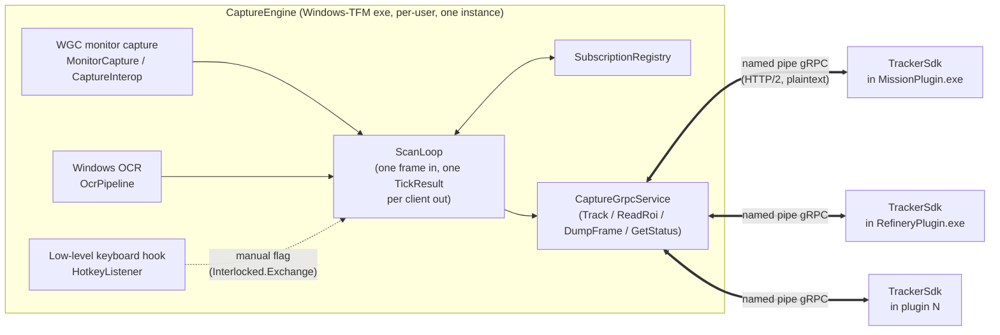

# Architecture

Star Citizen Tracker is a screen-capture engine plus one process per tracker plugin. The engine
owns capture, OCR, and pixel sampling; plugins own all game-semantic parsing and state. They
never share memory or a build — a plugin cannot take down capture, another plugin, or the process
that owns the screen.

## Process diagram

One named pipe, one gRPC channel per plugin process, one `Track` bidi stream per channel. Every
scanned frame produces one `TickResult` per connected client — never a partial one — because all
OCR in the engine happens inside `ScanLoop`, one frame at a time
(`src/CaptureEngine/ScanLoop.cs:9-14`). The wire contract, handshake, and the guarantees a plugin
may rely on are the subject of [`docs/PROTOCOL.md`](PROTOCOL.md); this document is about the
processes and projects that contract sits between.

## Frozen constraints

These were decided once, during the original engine/plugin split, and are not up for revisiting
inside a task (the task docs that recorded the decision live under `tasks/`, which is gitignored
and not part of the repo history — the constraints below are restated in full rather than linked):

- **Windows TFM stops at the engine.** Only `CaptureEngine` targets
  `net10.0-windows10.0.22621.0` (`src/CaptureEngine/CaptureEngine.csproj`) — it is the only project
  that touches WGC or Windows OCR. `CaptureContracts`, `TrackerSdk`, `TrackerSdk.Testing`, and every
  plugin target plain `net10.0`, so a plugin (or its CI) never needs a Windows OCR language pack to
  build or unit-test.
- **Per-tick atomicity.** Everything a plugin needs for one decision arrives in one `TickResult`
  read from one frame; a client's ROI set is swapped whole, never mutated mid-tick
  (`ClientConnection.cs:22-26`). No mid-tick round-trips exist in the protocol.
- **OCR-results-only boundary.** Only OCR text/geometry and small pixel buffers cross the wire.
  Raw full frames never leave the engine process — `DumpFrame` writes a PNG to disk from inside the
  engine and returns a path, it does not send bytes (`CaptureGrpcService.cs:199-237`).
- **Engine cannot be a session-0 Windows Service.** Windows Graphics Capture requires an
  interactive desktop session, so the engine is a normal per-user console exe, never a background
  service.
- **Reference ROI space is 2560x1440**, and the engine does all scaling to actual frame pixels
  server-side (`RoiScaler.cs:12-13`, `ScanLoop.ReadOneAsync` at `ScanLoop.cs:214`). Plugins declare
  ROIs once and never rescale a rect the engine reports back.
- **net10.0 (or the Windows-flavored net10.0) everywhere** — no other TFM appears in the solution.

## Component table

| Component | Path | Role |
| --- | --- | --- |
| `protos/capture.proto` | `protos/capture.proto` | The wire contract: `CaptureEngineService` (`Track`/`ReadRoi`/`DumpFrame`/`GetStatus`) and every message shape. Governed by `buf lint` + `buf breaking` in CI (`docs/PROTOCOL.md`). |
| `CaptureContracts` | `src/CaptureContracts/` | Plain `net10.0` library: generated proto code, plus the pure shared types both sides use — `RoiScaler`, `WireLimits`, `OcrRegionResult`, `PixelPatchSampler`, `RoiRect`, `ProtoMapping`, `ProtocolVersion`. |
| `CaptureEngine` | `src/CaptureEngine/` | The only Windows-TFM project. WGC capture (`Core/MonitorCapture.cs`), OCR (`Core/OcrPipeline.cs`), pixel sampling (`Core/PixelSampler.cs`), hotkey hook (`Core/HotkeyListener.cs`), replay (`Core/ReplayFrameSource.cs`), the scan loop (`ScanLoop.cs`), subscription bookkeeping (`SubscriptionRegistry.cs`, `ClientConnection.cs`), status (`EngineStatus.cs`), and the gRPC surface (`Grpc/CaptureGrpcService.cs`, `Grpc/GrpcHost.cs`). Composed by `EngineHost.cs`, entered from `Program.cs`. |
| `TrackerSdk` | `src/TrackerSdk/` | Plain `net10.0` client library. `NamedPipeChannel`/`CaptureClient`/`TrackSession` (connection + session), `RoiSubscription`/`RoiKind`/`TickData` (declaring and reading ROIs), `ProtocolNegotiation` (handshake + version errors), and the plugin-host layer under `Plugin/` — `ITrackerPlugin`, `TrackerPluginHost`, `TickDispatcher`, `PluginServices`. |
| `TrackerSdk.Testing` | `src/TrackerSdk.Testing/` | Public testing companion package (no `InternalsVisibleTo`): `TickDataBuilder`, `FakePluginServices`, `ReplayHarness`, `EngineLocator` — spawns a real `CaptureEngine.exe` against a corpus and drives a plugin's real `TrackerPluginHost` path for parity tests. |
| `Plugins/MissionPlugin` | `src/Plugins/MissionPlugin/` | Tracks mission-board text via `ITrackerPlugin`. |
| `Plugins/RefineryPlugin` | `src/Plugins/RefineryPlugin/` | Tracks refinery work orders via `ITrackerPlugin`; owns the order ledger. |
| `tests/` | `tests/` | One test project per component above, plus `tests/fixtures/corpus/<name>/` — the shared replay corpora (`docs/REPLAY.md`). |

## See also

- [`docs/PROTOCOL.md`](PROTOCOL.md) — transport, handshake, version policy, coordinate spaces, tick
  atomicity, backpressure: the agreements the wire contract carries.
- [`docs/ENGINE-SERVICES.md`](ENGINE-SERVICES.md) — the engine's service catalog: what each RPC
  does, every budget and constant, replay mode, and the hotkey/`--save-frames` path.
- [`docs/REPLAY.md`](REPLAY.md) — corpus layout, capturing one in-game, and how `ReplayHarness`
  runs one against a real plugin.
- [`docs/PLUGIN-AUTHORING.md`](PLUGIN-AUTHORING.md) — how to write a new `ITrackerPlugin` from
  scratch: project setup, the tick surface, ROI calibration, error policy, and testing.
